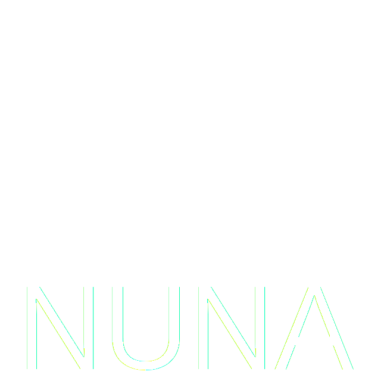
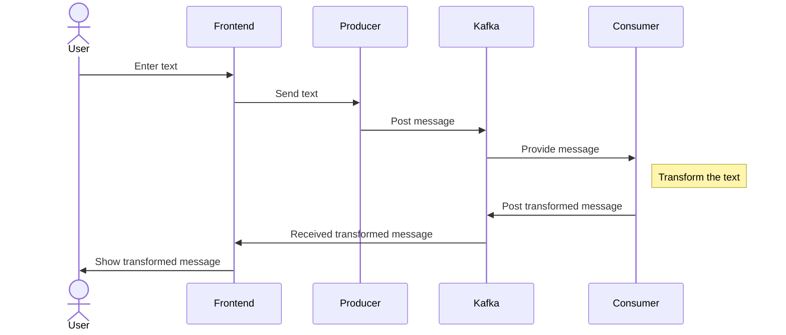

      

# Nuage Natif - Overview

Nuage Natif (Nuna) is a personal project aiming at improving myself is the cloud natives technologies like Docker, Kubernetes, CI/CD, etc.

The Nuna project consist in three main component, the consumer, the producer and the frontend around Kafka.

## Technologies

| Name                  | Version | Description                                       |
| :-------------------- | :------ | :------------------------------------------------ |
| Proxmox               | 8.1.4   | Virtualizattion the cluster                       |
| Kubernetes            | 1.29.3  | Orchestration                                     |
| Knative               |         | Auto-scaling on event or traffic                  |
| Keda                  |         | Auto-scaling on event                             |
| Strimzi               |         | Kafka management tool for Kafka in K8s            |
| Kafka                 |         | Message queue                                     |
| ArgoCD/FluxCD/Sveltos |         | Continuous delivery tool for GitOps               |
| Quarkus               | 3.9.2   | Java framework for deployment on K8s              |
| Maven                 | 3.6.3   | Java project management and build automation tool |
| Java                  | 21.0.2  | Developement language                             |

